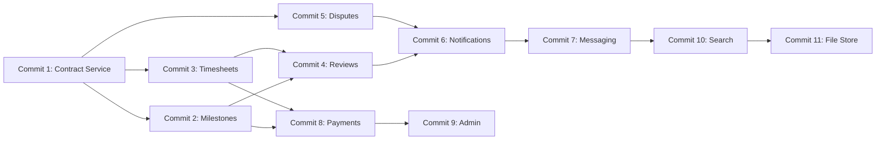

# JobConnect — Feature Roadmap

## What Exists Today

| Service | Port | RPCs | Status |
|---------|------|------|--------|
| **auth** | 50051 | Register, VerifyEmailOTP, Login, RefreshToken, Logout | ✅ Complete |
| **user** | 50052 | CreateProfile, GetProfile, UpdateProfile, DeleteProfile, GetOnboardingStatus, UploadAvatar, GetAvatar, RemoveAvatar | ✅ Complete |
| **job** | 50053 | CreateJob, GetJob, UpdateJob, ListMyJobs, ListOpenJobs (with search/filter), CloseJob | ✅ Complete |
| **proposal** | 50054 | SubmitProposal, ModifyProposal, WithdrawProposal, GetProposal, ListProposalsByJob, ListMyProposals, SetProposalStatus | ✅ Complete |

> [!NOTE]
> All four core services are functional skeletons. What's missing is the features that tie them together into a working marketplace — contracts, payments, messaging, notifications, and admin tooling.

---

## Phase 2 — Contracts & Milestones

The bridge between "freelancer gets hired" and "work gets delivered." This is the **most critical missing piece** — without it, there's no formal agreement after a proposal is accepted.

---

### Commit 1: `feat(contract): contract service skeleton`

Create `services/contract/` with hexagonal architecture matching `job`/`proposal`.

**What it does**: When a proposal status is set to `HIRED`, a contract is created linking the client, freelancer, and job.

**Proto RPCs**:
- `CreateContract` — triggered after hiring
- `GetContract` — fetch by ID
- `ListMyContracts` — for both clients and freelancers
- `EndContract` — marks contract as completed or terminated

**Domain entities**:
- `Contract` — id, job_id, proposal_id, client_id, freelancer_id, title, description, contract_type (fixed/hourly), total_amount, currency, status (active/completed/terminated/disputed), start_date, end_date, created_at
- Status transitions: `active → completed`, `active → terminated`, `active → disputed`

**Migration**: `contracts` table with FKs to jobs and proposals

---

### Commit 2: `feat(contract): milestone management`

Add milestones within fixed-price contracts.

**Proto RPCs**:
- `AddMilestone` — client defines deliverables with amounts
- `ListMilestones` — list by contract
- `UpdateMilestone` — edit before freelancer starts
- `SubmitMilestone` — freelancer marks as done
- `ApproveMilestone` — client approves, releases payment
- `RequestRevision` — client asks for changes

**Domain entity**:
- `Milestone` — id, contract_id, title, description, amount, due_date, status (pending/in_progress/submitted/revision_requested/approved/paid), order

**Migration**: `milestones` table with FK to contracts

---

### Commit 3: `feat(contract): timesheet tracking for hourly contracts`

Track hours for hourly-rate contracts.

**Proto RPCs**:
- `LogTime` — freelancer logs hours with description
- `ListTimeEntries` — by contract, with date range filter
- `ApproveTimesheet` — client approves a week's entries
- `GetWeeklySummary` — aggregated hours + cost for a given week

**Domain entity**:
- `TimeEntry` — id, contract_id, date, hours, description, status (logged/approved/disputed), created_at

**Migration**: `time_entries` table with FK to contracts

---

## Phase 3 — Reviews & Disputes

Trust infrastructure — what makes freelancers and clients choose each other.

---

### Commit 4: `feat(review): review service`e

Both sides rate each other after a contract completes.

**Proto RPCs**:
- `SubmitReview` — one per side per contract
- `GetReview` — by ID
- `ListReviewsForUser` — public reviews visible on profiles
- `GetUserRating` — aggregated score (average + count)

**Domain entity**:
- `Review` — id, contract_id, reviewer_id, reviewee_id, rating (1-5), comment, created_at
- **Constraint**: one review per reviewer per contract, can only review after contract is completed

**Migration**: `reviews` table with unique constraint on `(contract_id, reviewer_id)`

---

### Commit 5: `feat(dispute): dispute resolution`

Handle conflicts during active contracts.

**Proto RPCs**:
- `OpenDispute` — either party can open, with reason and evidence
- `GetDispute` — by ID
- `ListDisputes` — for admins
- `AddDisputeMessage` — threaded conversation
- `ResolveDispute` — admin decision (refund, pay freelancer, split)

**Domain entity**:
- `Dispute` — id, contract_id, opened_by, reason, status (open/under_review/resolved), resolution, resolved_by, created_at
- `DisputeMessage` — id, dispute_id, sender_id, message, attachments, created_at

**Migration**: `disputes` + `dispute_messages` tables

---

## Phase 4 — Platform Infrastructure

Features that aren't new services but are essential for a real product.

---

### Commit 6: `feat(notification): notification service`

Event-driven notifications across all services.

**Proto RPCs**:
- `ListNotifications` — user's notification feed
- `MarkAsRead` — single or batch
- `GetUnreadCount` — for badge display

**Events to handle** (consumed from other services):
- Proposal submitted/shortlisted/rejected/hired
- Contract created/completed
- Milestone submitted/approved/revision_requested
- Dispute opened/resolved
- Review received

**Implementation**: Start with a simple polling model (gRPC). Can evolve to WebSocket/SSE later for real-time.

**Migration**: `notifications` table

---

### Commit 7: `feat(messaging): direct messaging between client and freelancer`

Conversation threads tied to jobs or contracts.

**Proto RPCs**:
- `SendMessage` — with optional attachments
- `ListConversations` — user's inbox
- `GetConversation` — message thread
- `MarkConversationRead`

**Domain entities**:
- `Conversation` — id, job_id (optional), contract_id (optional), participants[], created_at
- `Message` — id, conversation_id, sender_id, body, attachments, read_at, created_at

**Migration**: `conversations`, `conversation_participants`, `messages` tables

---

### Commit 8: `feat(payment): payment/escrow service`

Handle money flow (placeholder for payment gateway integration).

**Proto RPCs**:
- `CreateEscrow` — lock funds when contract starts
- `ReleaseMilestonePayment` — release on milestone approval
- `ProcessHourlyPayment` — release on timesheet approval
- `RequestRefund` — tied to disputes
- `GetPaymentHistory` — ledger for a user

**Domain entities**:
- `EscrowAccount` — contract_id, total_funded, total_released, balance
- `Transaction` — id, escrow_id, type (fund/release/refund), amount, description, created_at

> [!IMPORTANT]
> This service will need actual payment gateway integration (Stripe, PayPal, etc.) in production. Start with the domain model and a mock gateway.

---

## Phase 5 — Admin & Polish

---

### Commit 9: `feat(admin): admin dashboard RPCs`

Power tools for platform operators.

- `ListAllJobs` — with filters (status, date range, flagged)
- `ListAllUsers` — with role filter, suspension status
- `SuspendUser` / `ReinstateUser`
- `FlagJob` / `RemoveJob` — content moderation
- `GetPlatformStats` — total jobs, active contracts, revenue, etc.

---

### Commit 10: `feat(search): dedicated search with indexing`

Replace the ILIKE/JSONB queries with proper full-text search.

- Add PostgreSQL `tsvector` columns + GIN indexes on jobs
- Or introduce Elasticsearch/Meilisearch as a read-optimized index
- Faceted search (by skill, budget range, job type, location)

---

### Commit 11: `feat(filestore): centralized file upload service`

Right now attachments store URLs but there's no upload mechanism.

- `UploadFile` — returns a signed URL or stores to S3/MinIO
- `GetFileURL` — signed download URL with expiry
- `DeleteFile` — cleanup

Used by: job attachments, proposal attachments, dispute evidence, messages, avatars

---

## Recommended Build Order

> [!TIP]
> **Start with Commit 1** (Contract service). Everything else depends on having a formal contract entity that bridges the hiring event to the work delivery phase. Without it, proposals that get hired lead nowhere.
